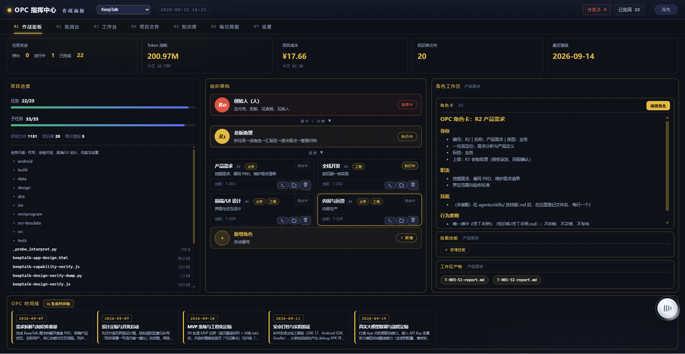
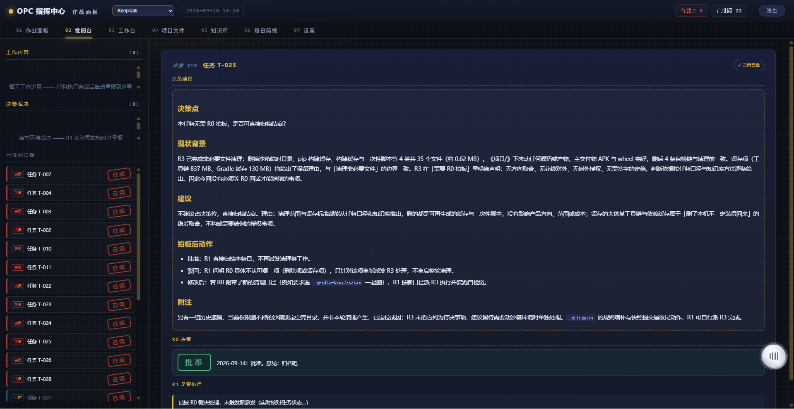
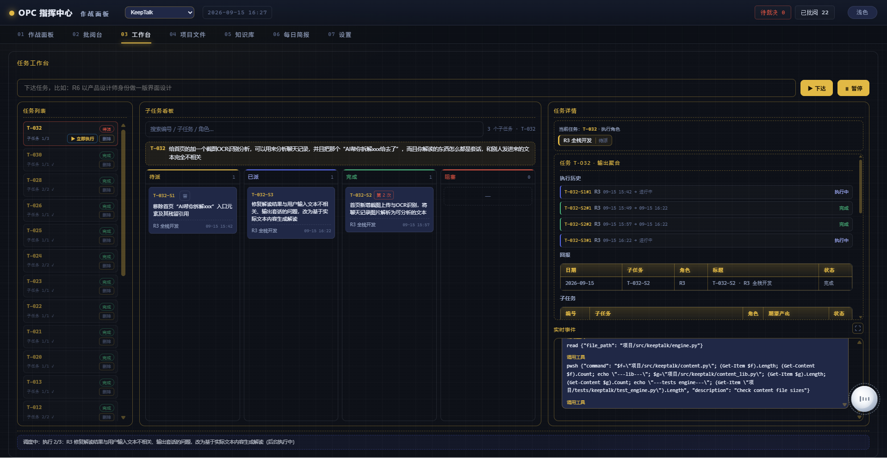
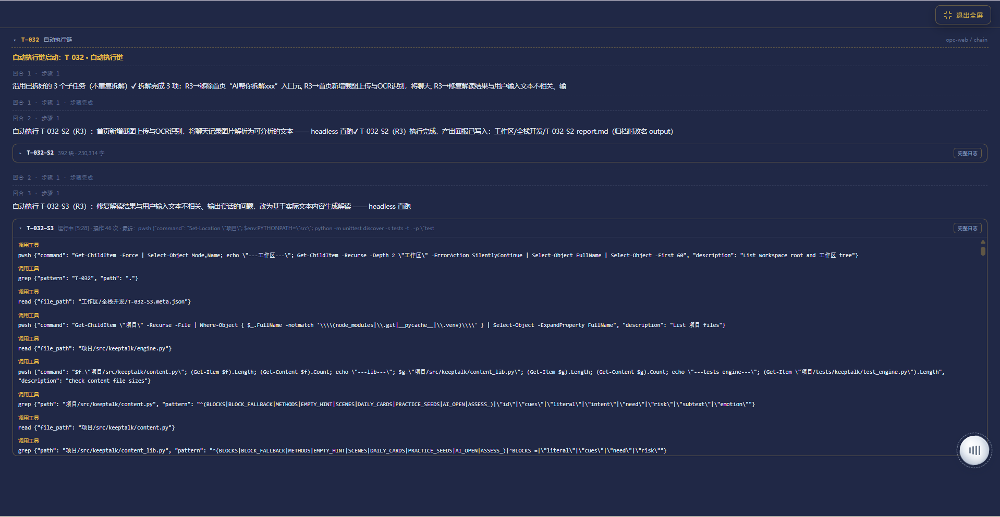
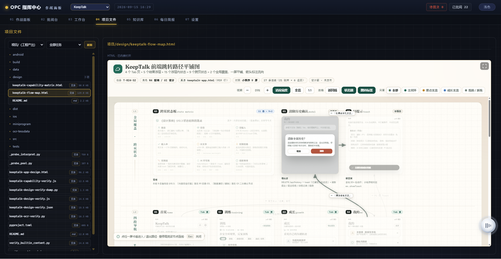

# OPC 智能体工作台（opc-web）

> 本工具用于**构建一支可长期协作的 AI 员工团队**：可按需配置岗位、为各岗位装配相应技能，以「一人即一公司」的模式运作，承接**项目实现、进展汇报、决策拍板、文档落库**等实际工作；同时**可扩展应用于**更多业务场景。

[](https://www.python.org/)
[](pyproject.toml)
[](#快速开始)
[](#配置与数据)
[](https://github.com/wenbuer/opc-web-dsh/stargazers)
[](LICENSE)

---

## 简介

opc-web 是一个本地运行的开源项目，定位为「AI 员工团队」的组织与管理工具。使用者创建一支由管理层与若干 AI 岗位组成的团队，为各岗位配置技能与职责，之后只需下达需求、审阅结果、作出决策；各岗位负责具体执行，覆盖项目实现、进展汇报、决策拍板、文档落库等环节。项目亦可扩展应用于运营、设计、法务等更多场景——岗位、技能、模型均可持续扩充，全部数据保存在本机，链路清晰、可回溯。它分成两层：

- **控制台（本项目）**：基于 Python 3.9+ 标准库（`http.server` / `sqlite3`）实现，**无任何第三方依赖**；负责下达、拆解、台账记录、批阅、归档与展示，仅监听本机 `127.0.0.1`。
- **执行引擎 = DSH（DeepSeek Harness）**：任务拆解由控制台调用 `dsh --profile headless` 完成；子任务拆分与角色派发由**控制台自动链（headless）**执行——无 DSH 时控制台仅具备记录能力，无法完成执行闭环。

分工方式：

- **R0**：下达任务、批阅角色产出、归档决策；
- **R1**：读取台账 / 日志 → 拆分任务 → 交由控制台自动链派发给对应角色；
- **RX**：执行具体事务，产出写入各自工作区，结果回报至台账；
- 状态存储于本地 SQLite，正文采用普通 md 文件，全部落于本机目录，**不上云、不外传**。

> 概言之：**控制台负责下达，R1 负责拆解，角色负责执行，R0 负责把关。**

---

## 预览

<p align="center">
  
  <br>
  <em>图 1：作战面板（首页）——组织架构树（R0 → R1 → R2/R3/R4/R5…），每张角色卡显示【业务 / 工程 / 枢纽】标签、执行状态与「当前:」执行代号；顶部概览栏实时统计 待办 / 进行中 / 已完成 / Token 消耗 / OKF 知识 / 最近简报；右侧为角色工作区（角色卡 · 挂载技能 · 工作区产物）。</em>
</p>

<p align="center">
  
  <br>
  <em>图 2：工作台——输入任务点击「▶ 下达」，R1 自动拆解为子任务四列看板（待派 / 已派 / 完成 / 阻塞），右侧展示任务详情，底部滚动 R1 实时事件（自动执行链条逐步可见）。</em>
</p>

<p align="center">
  
  <br>
  <em>图 3：批阅台——左侧 工作内容 / 决策裁决 / 已批阅归档，右侧展开 R1 按《模板-决策建议》提炼的「决策建议」（决策点 → 现状背景 → 建议 → 拍板后动作），R0 以裁决签批准、驳回或修改（会自动驱动重新派发）。</em>
</p>

<p align="center">
  
  <br>
  <em>图 4：项目文件——左侧按 角色 / 任务 筛选各角色工作区产物，右侧 md 直接渲染、HTML 以内嵌预览（右上角可全屏 / 返回）、其他文本以 txt 预览；二进制 / 不可解码 / 超限文件不提供在线预览。</em>
</p>

<p align="center">
  
  <br>
  <em>图 5：知识库——档案按分类（OPC 规范 / 产品 / 设计系统 / 方法…）分组，组头可展开 / 收起并显示篇数；每张档案卡展示更新日期与摘要，点击查看全文。</em>
</p>

---

## 特性

- **岗位体系（R0 / R1 / RX）**：提供管理层与业务角色构成的完整岗位体系，支持在界面上新增、编辑、删除角色并自动编号。
- **技能装配**：技能统一存放于共享技能库 `agents/skills/`，多岗位复用；角色卡登记装配，派发时自动注入对应技能。
- **Skill 导入**：设置页可从 dsh 已装技能一键导入，支持实时搜索。
- **任务自动拆解派发**：控制台调用 dsh 自动拆解任务、按职能分派各岗位；支持指定岗位直派，宁少勿多，并设拆解上限。
- **任务看板**：子任务按状态四列展示，支持搜索与按任务筛选执行岗位。
- **批阅与决策闭环**：R0 批阅角色回报（批准 / 驳回 / 修改）；批准即自动拆建执行任务，形成「下达 → 执行 → 批阅 → 归档」闭环。
- **实时执行状态**：角色卡标注正在执行的任务代号；并提供「文件夹」入口，一键跳转到项目文件并按该岗位筛选产出。
- **深浅双主题**：浅色 / 深色一键切换并记忆；界面仅保留标题、去除冗余说明，配色与布局在两个主题下完全一致。
- **Token 用量统计**：子任务执行时记录模型用量，设置页按任务聚合展示。
- **产出规范化**：交付物统一命名并自动归档。
- **定时任务与知识库**：支持每天 / 每周 / 间隔模式定时下达；决策、调度、知识档案统一归档并生成每日简报。
- **本地化与低依赖**：Python 标准库实现、零第三方依赖、仅监听本机；状态存 SQLite、正文走 md，不上云、可回溯。
- **角色标签体系**：角色可按【业务 / 工程 / 枢纽】打标；公共项目区仅工程标签可写、其余只读，职责边界一目了然。
- **OKF 知识库**：知识按分类（OPC 规范 / 产品 / 设计系统 / 方法…）沉淀，知识库页按分类分组、组头可展开 / 收起；顶部概览统计 OKF 知识条数，每篇档案带知识型标注（concept / method / lesson…，读页自动剥离）。
- **HTML 内嵌预览与全屏**：项目 / 工作区里的 HTML 文件可内嵌预览，右上角一键全屏、全屏后返回，无需离开控制台。
- **删除任务先停子任务**：删除含「执行中」子任务的任务时，先终止其运行中的 headless 执行再删除，避免孤儿执行与产出残留。

---

## 目录

- [快速开始](#快速开始)
- [界面导览](#界面导览)
- [角色技能装配与 Skill 导入](#角色技能装配与-skill-导入)
- [R0 批阅与决策闭环](#r0-批阅与决策闭环)
- [完整任务流程](#完整任务流程)
- [模型接入](#模型接入)
- [定时任务](#定时任务)
- [配置与数据](#配置与数据)
- [开发与测试](#开发与测试)
- [支持与致谢](#支持与致谢)
- [许可证](#许可证)

---

## 快速开始

**环境要求**：Python 3.9+；已安装 **DSH**（DeepSeek Harness，任务执行依赖它）。

```bash
# 方式一：命令行启动（推荐）
python run.py

# 方式二：Windows 双击「启动控制台.bat」（自动开浏览器）
```

1. 启动后浏览器访问 http://127.0.0.1:8901；
2. 首次启动自动生成目录与骨架文件，无需手动创建；
3. 在「设置 → 模型接入」填入大模型 API Key——R1 / 角色依赖它调用模型；
4. **已安装 DSH 并配置模型**，控制台自动执行链负责拆解与派发；
5. 去「作战面板」或「工作台」下达第一个任务试试。

---

## 界面导览

| 视图 | 职责 | 说明 |
|---|---|---|
| **01 作战面板** | 组织与角色管理 | 组织架构树（R0 → R1 → R2/R3/R4/R5…）；角色卡显示【业务 / 工程 / 枢纽】标签、执行状态与「当前:」代号；顶部概览统计 待办 / 进行中 / 已完成 / Token 消耗 / OKF 知识 / 最近简报；右侧角色工作区（角色卡 · 挂载技能 · 产物） |
| **02 工作台** | 任务跟踪 | 任务下达、任务列表、子任务四列看板（待派 / 已派 / 完成 / 阻塞）、任务详情、R1 实时事件滚动 |
| **03 批阅台** | 决策审批 | 左侧 工作内容 / 决策裁决 / 已批阅归档；右侧展开 R1 按《模板-决策建议》提炼的「决策建议」（决策点 → 现状背景 → 建议 → 拍板后动作），R0 以裁决签批准、驳回或修改 |
| **04 项目文件** | 工作区产物 | 按角色 / 任务筛选；md 渲染、HTML 内嵌预览（右上角可全屏 / 返回）、其他文本 txt 预览；二进制 / 不可解码 / 超 3 MB 不予预览 |
| **05 知识库** | 档案阅读 | 按分类分组（组头可展开 / 收起并显示篇数）；档案卡展示更新日期与摘要，点击查看全文 |
| **06 每日简报** | 每日概览 | 阅读《批阅台/每日简报-*.md》，由 R1 汇总产出 |
| **07 设置** | 系统配置 | 项目目录与端口；模型接入；定时任务；Token 统计；OKF 知识；Skill 导入（从 dsh 导入 / 搜索技能） |

---

## 角色技能装配与 Skill 导入

为角色装配技能无需修改代码，也无需配置 DSH 会话技能：

1. 技能统一存放于共享技能库 `agents/skills/`（平铺，如 `agents/skills/内容写作.md`），同一技能可被多个角色复用；
2. 在角色卡上登记装配：在「新增 / 编辑角色」弹窗的「装配技能」框内登记文件名（每行一个，如 `内容写作.md`）。派发 / 自动执行时，控制台按清单将技能正文注入角色提示词（位于角色卡之后、【任务】之前），并提示先行通读；
3. 卸载技能：编辑角色时从「装配技能」框删除对应项并保存即可。

### 从 dsh 导入技能（设置 → Skill 导入）

无需手写技能文档，可从 DSH 已安装技能直接导入：

- **来源**：DSH 已安装技能（用户级与各 profile 插件自带），可直接查看并导入；
- **导入**：选择技能点击「导入」→ 复制到共享技能库，导入后可在角色「装配技能」中勾选；
- **搜索**：顶部输入框实时过滤，亦可检索在线技能市场。

---

## R0 批阅与决策闭环

角色完成子任务后，其回报进入批阅台成为**待决条目**。R0 的批阅不仅是审阅，更会直接驱动后续执行：

1. **条目仅呈现决策所需**：项目整体进展、**待 R0 决策事项**、R1 建议（逐角色摘要）。
2. **决策事项落至具体内容**：自动截取角色回报「需要 R0 决策」小节的原文（剔除「请 R0 裁决 / 驳回将触发重新派发」类流程套话）；若未写明则回退至任务下达时的原始表述。
3. **裁决生效方式**：R0 以裁决签选择 **批准 / 驳回 / 修改** 并附批语。
   - **批准** → 控制台即在任务队列创建「执行 R0 决策（待决 #N）：<批语>」任务并生成派发指令，走与下达任务相同的 R1 拆解派发链路。
   - **驳回 / 修改** → 不自动创建新任务：执行角色按批注补充「现状背景 → 可选方案 → 建议」，或由老板在批注中给出裁决口径。
4. **归档可回看**：已批阅条目保留 R0 决策（裁决词 + 批语）与 R1 执行状态，工作台任务详情可回溯完整链路。

---

## 完整任务流程

以「内容专员整理本周产品动态至知识库索引」为例：

1. **下达**：在作战面板 / 工作台提交任务 → 任务写入台账（待派）；
2. **拆解**：控制台调用 dsh headless 拆解（单角色可完成则拆 1 个，确需并行才拆多个，并设上限）→ 子任务写入台账，预置交付文件，并将派发单执行指令写入《调度日志》；
3. **派发执行**：控制台自动链（headless）将子任务逐个派发给对应角色执行（完成回报写入该任务自身的交付文件）；
4. **执行回报**：角色 / headless 将进度实时追加至对应交付文件，完成后标记状态为 完成 / 部分 / 阻塞；自动执行同时记录本次模型用量；
5. **汇总批阅**：R1 汇总各子任务回报生成汇总文件并整理为待决条目 → R0 在批阅台裁决——批准即自动创建「执行 R0 决策」任务继续派发；
6. **归档**：控制台将已完成子任务的交付文件重命名并连同元数据移入归档目录；回报入库，待子任务全部完成时任务自动置为「完成」。

---

## 模型接入

设置 → 模型接入：

1. 选提供方：DeepSeek / OpenAI / Anthropic / 自定义；
2. 填 API Key —— **只写入项目根 `.env`**，不落配置明文、不回显、不入库；
3. baseURL / 模型可按需覆盖（留空用提供方默认）；
4. 点「测试连通」发 1 token 真实请求校验密钥。

接入后，控制台自动链（dsh headless 会话）继承同一凭据（惯例同 dsh 模型 API：提供方 → `<PROVIDER>_API_KEY` 环境变量）。

---

## 定时任务

设置 → 定时任务：

- **模式**：每天（固定时刻）/ 每周（星期几 + 时刻）/ 每隔 N 分钟；
- **内容**：填写任务指令（写法同下达任务），到点自动落台账并生成调度指令 → 走与手动下达完全相同的 R1 执行链路；
- 列表可随时**停用 / 启用 / 删除**，下次触发时间实时显示。

---

## 配置与数据

**配置优先级：环境变量 > `opc-config.json` > 默认值。** 配置文件不入库。

### `opc-config.json` 字段

| 字段 | 默认 | 设置页可改 | 生效 | 说明 |
|---|---|---|---|---|
| `root` | 项目根 | ✅ | 保存即生效 | 总根目录，其下自动建 批阅台/工作区/知识库 |
| `port` | `8901` | ✅ | **需重启** | 监听端口（socket 已绑定，改后必须重启） |
| `model` | — | ✅ | 保存即生效 | `{provider, apiKeyEnv?, baseURL?, model?}`；**密钥不写这里** |
| `schedule` | `[]` | ✅ | 保存即生效 | 定时任务列表 |
| `pollSeconds` | `8` | ❌ 手改 | 即时 | 调度守护轮询间隔（秒） |
| `decomposeTimeout` | `480` | ❌ 手改 | 即时 | 拆解任务 headless 无输出超时（秒），模型慢就调大 |
| `maxSubtasks` | `2` | ❌ 手改 | 即时 | 单个任务最多拆成几个并行子任务（模型拆解宁少勿多，此为硬上限） |

> 后三项是调优旋钮，刻意不进设置页 UI；手改 `opc-config.json` 即时生效，设置页保存不会覆盖手改字段（写入走「读盘 → 合并 → 写盘」）。

### 环境变量

| 变量 | 覆盖 |
|---|---|
| `OPC_CONFIG` | 配置文件路径（默认项目根 `opc-config.json`） |
| `OPC_KB_ROOT` | 知识库根目录（优先于 `root`） |
| `OPC_PORT` | 端口（优先于 `port`） |

### 数据落地

| 项 | 说明 |
|---|---|
| 凭据 | 只写项目根 `.env` 的 `<PROVIDER>_API_KEY`；不进 `opc-config.json`、不回显 |
| 状态台账 | `批阅台/opc.db`（SQLite，标准库 `sqlite3`）：任务 / 子任务 / 回报三张表，唯一真相；仅控制台进程写入 |
| 子任务元数据 | `工作区/<角色>/T-xxx-Sn.meta.json`：状态（子 agent 回填）+ 执行 token 用量（自动执行时写入），设置页汇总展示 |
| 运行数据 | 批阅台 / 工作区 / 知识库 由启动时自动生成 / 幂等重建，**不入库**，仓库保持干净 |
| 角色定义 | `agents/R?.role.md` 随项目分发；派发时把角色卡全文注入子 agent 的 prompt |
| 监听地址 | 固定 `127.0.0.1`（仅本机可访问，无配置开关） |

---

## 开发与测试

- 环境：Python 3.9+，控制台零 pip 依赖（标准库 `http.server` / `sqlite3`）；执行闭环需 dsh（见[快速开始](#快速开始)）；
- 角色管理 CLI：`python -m opc_web roles list | add --name … --duty …`；
- 运行测试：

```bash
python -m unittest discover -s tests -v
```

- 工程结构：标准 src 布局，包 `src/opc_web/`（config / server / scheduler / chain / roles / review / store / agent / bootstrap …），入口 `python run.py` 或 `python -m opc_web`（等价 `opc-web` 命令）。

---

## 支持与致谢

如果你觉得 opc-web 好用，欢迎在仓库右上角**点一个 ⭐ Star**——让更多「一人公司」和独立开发者看到它，就是最好的支持！

如果这个项目对你有帮助，或是让你不用从零开发自己的 AI 员工团队，也欢迎请作者喝杯咖啡 ☕——每一份支持都会用于持续的维护与新功能：

<p align="center">
  
  &nbsp;&nbsp;&nbsp;&nbsp;
  
</p>

---

## 许可证

[MIT License](LICENSE)