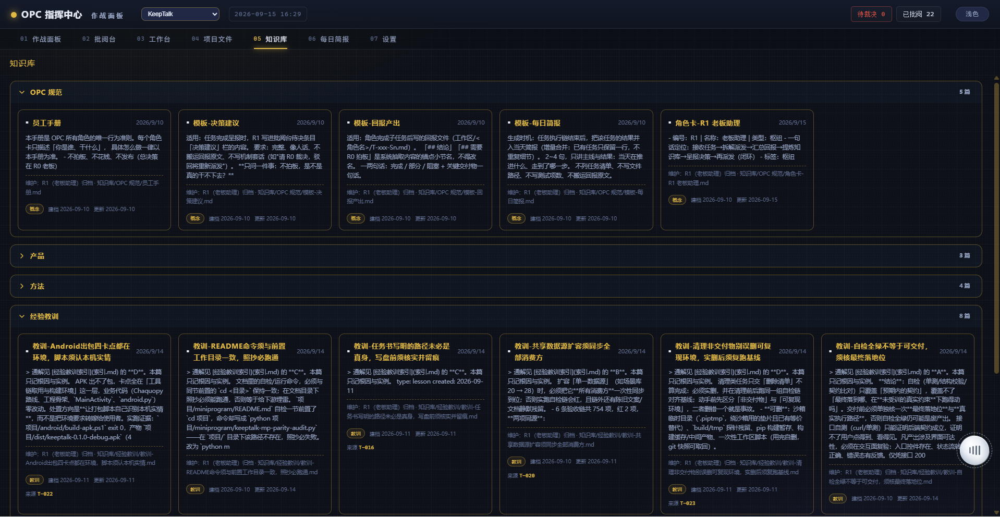
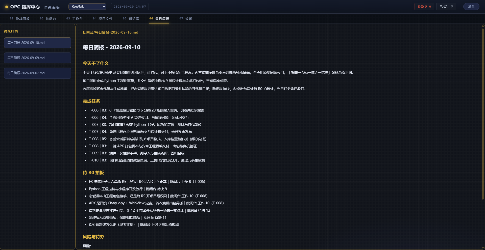
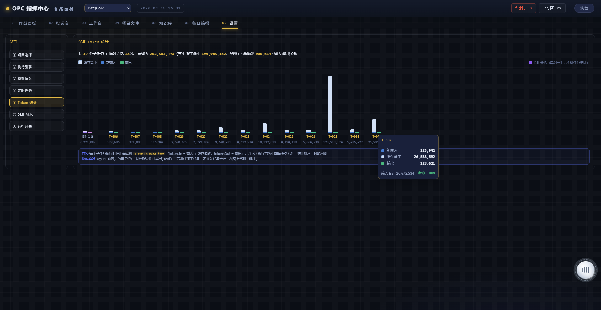
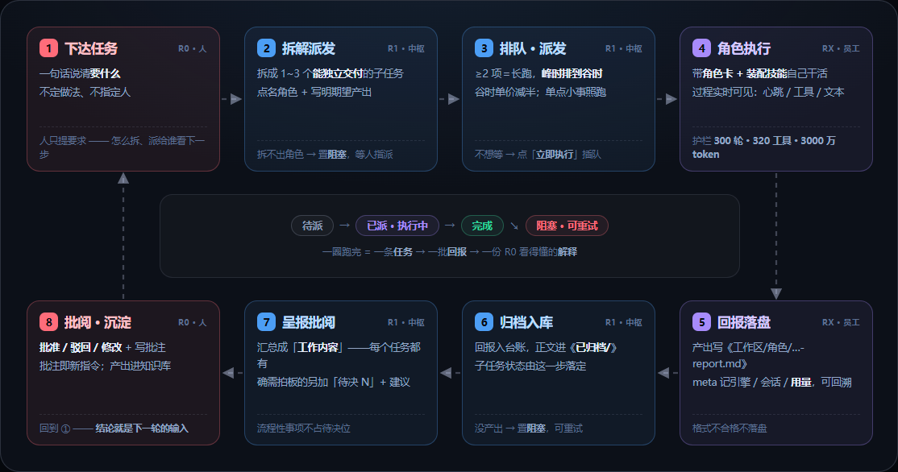

# OPC 智能体工作台

> 一人公司全流程智能体工作台 —— **下达一句话，收一份能拍板的汇报。**

[](https://www.python.org/)
[](pyproject.toml)
[](#执行引擎)
[](#配置与数据)
[](LICENSE)
[](https://github.com/wenbuer/opc-web)

---

## 预览

<table>
<tr>
<td width="25%"><br><sub>作战面板 · 组织架构与角色状态</sub></td>
<td width="25%"><br><sub>工作台 · 下达任务与看板</sub></td>
<td width="25%"><br><sub>批阅台 · 裁决角色回报</sub></td>
<td width="25%"><br><sub>项目文件 · 工作区产物</sub></td>
</tr>
<tr>
<td width="25%"><br><sub>项目文件 · 文件预览</sub></td>
<td width="25%"><br><sub>知识库 · 深色主题</sub></td>
<td width="25%"><br><sub>每日简报 · 当天摘要</sub></td>
<td width="25%"><br><sub>设置 · Token 与成本</sub></td>
</tr>
</table>

<p align="center">
  
  <br>
  <em>图 9：任务闭环 —— 八步一圈。人只在 ① 下达与 ⑧ 批阅出场（红）；②③⑥⑦ 是 R1 中枢（蓝）；④⑤ 是真正动手的 RX 角色（紫）。</em>
</p>

---

## 简介

opc-web 是一个**本地运行**的「AI 员工团队」管理控制台。你创建岗位、给岗位装技能，然后下达需求、审阅结果、作出决策；团队负责拆解、执行、汇总与归档。

- **控制台（本项目）**：Python 3.9+ 实现，运行时只多一个包（`zstandard`，解 DSH 会话日志用；只用直连 API 引擎的话不装也行），仅监听本机 `127.0.0.1`
- **执行角色**：由**可替换的执行引擎**驱动 —— 默认**直连大模型 API**，也可换成 DSH（DeepSeek Harness）headless（见[执行引擎](#执行引擎)）

> **R0** 下达与拍板 → **R1** 拆解与归档 → **RX** 执行与回报。状态存本地 SQLite、正文走 md，**不上云、不外传**。

---

## 闭环是怎么转的

一条任务从下达到收口，走八步一圈（见上图）：

| 段 | 谁在做 | 干什么 |
|---|---|---|
| **任务** | R0 · R1 | 人说清「要什么」→ R1 拆成能独立交付的子任务 → 按优先级与峰谷决定何时跑 |
| **角色** | RX | 带角色卡与装配技能，在项目内自己用工具干活 → 产出落工作区、写回报 |
| **解释** | R1 · R0 | R1 把回报汇总成人能看懂的东西、该拍板的给决策建议 → R0 批阅，**批注即新指令** |

一圈跑完，产出同时进台账与知识库；**上一轮的结论就是下一轮的输入**，所以它越用越准。

---

## 特性

### 任务与派发

- **一句话下达，自动拆解派发**  
  按「能不能独立交付」拆成 1~3 个子任务，每项点名角色 + 写明期望产出。也可点名直派（跳过拆解），或从角色卡片上的终端直接下达。

- **队列优先级**  
  子任务看板「待派」每条一个单字芯片（高 / 普 / 低），点一下循环切换。调度挑任务、任务内执行顺序**都按它算** —— 峰时堆积时它不是锦上添花，是唯一能排序的地方。

- **峰谷成本调度**  
  官方峰时（工作日北京时间 09:00-12:00 / 14:00-18:00）三档单价翻倍。**拆出 ≥2 项的长任务**在峰时自动排队到谷时开跑，单点小事照跑不耽误人；不想等，任务行上点「立即执行」豁免峰时并插到队首。

- **定时任务**  
  每天 / 每周 / 每隔 N 分钟。任务存在项目数据目录（`批阅台/定时任务.json`），随项目仓库走，换机器不丢。

### 执行

- **可替换执行引擎**  
  默认直连大模型 API 跑内置工具循环，也可换成 DSH；两套共用同一条进度与用量口径，主引擎跑不起来时自动用备用引擎兜底（见[执行引擎](#执行引擎)）。

- **岗位体系与技能装配**  
  R0 / R1 / RX 三级岗位，界面增删角色自动编号；技能放在共享技能库、角色卡登记即装配，也可从本机技能源一键导入。技能是**项目资产**，换引擎不换技能。

- **过程实时可见**  
  角色卡显示当前任务代号；工作台四列看板（待派 / 已派 / 完成 / 阻塞）配实时事件流，能看到执行到哪一步、调了什么工具、此刻在想什么。

- **执行护栏（超限即停，不假装完成）**  
  单次运行有**三道闸**：轮数 300 / 工具调用 320 / 累计输入 3000 万 token，任一越界立即中止。被中止的运行按**阻塞**收口并留痕 —— 产出文件确实变长了，但活是腰斩的，绝不判成「完成」把半成品当交付件呈报。

- **失败不静默**  
  归档、元数据、收尾链路里的异常一律在事件流留 ⚠，不再静默吞掉。产出没入库、状态没收口，界面上看得见。

### 回报、决策与知识

- **回报自动落盘与归档**  
  产出写 `工作区/<角色>/T-xxx-Sn-report.md` + 同名 `.meta.json`（记引擎 / 会话 / 用量），完成后正文移进 `已归档/`、回报入台账。**文件在＝待处理，文件移走＝已处理**，文件系统本身就是状态机。

- **批阅即驱动执行**  
  批准会立即创建「执行 R0 决策」任务继续往下跑，驳回则按批注重做 —— 形成「下达 → 执行 → 批阅 → 归档」闭环。批阅台三条通道（工作内容 / 决策裁决 / 已批阅归档）各自滚动，互不打扰。

- **工作内容必有、决策裁决附加**  
  每个任务都进「工作内容」；只有**真正需要拍板**的（方向取舍 / 花钱对外 / 例外授权 / 验收定稿）才另加一条「待决 N」，两条同号。归档口径、是否结案这类流程性事项由控制台自己处理，不占决策位。

- **OKF 知识库**  
  任务收尾由 R1 判定有无沉淀价值，有价值才按主题域归档、同主题合并进已有档案；每篇带 OKF front-matter（知识型 / 建档 / 更新 / 来源任务），流水账一律不沉淀。

- **每日简报**  
  当天任务自动汇总成简报。写入前做**结构校验**：模型返回的包装（前置说明、代码块围栏、结尾注）一律剥掉，不合格就不落盘、改走代码级合并 —— 坏格式进不了文件。

### 成本与运维

- **Token 计量与项目成本**  
  三档单价分开算：**新输入 / 缓存命中 / 输出**。这不是洁癖 —— 台账里的 `tokensIn` 是「新输入 + 缓存读取」的合计，而缓存命中价通常只有输入的 1/10，不分档会把成本算高近十倍。首页单位自动换算（120.7M），同时给总额与今日。

- **运行开关集中管理**  
  R1 助理悬浮窗、峰时长任务排队等开关集中在「设置 → 运行开关」，全部落到项目配置文件里持久化；后面新增的开关也往这里放。

- **本地优先**  
  SQLite + md 文件，仅监听本机；数据全在本地，可回溯、不上云。

- **极简依赖**  
  除 `zstandard` 外全是标准库。单文件启动入口 `run.py`，Windows 还能双击 `启动控制台.bat`。

- **深浅双主题**  
  一键切换并记忆。

---

## 快速开始

**环境要求**：Python 3.9+，外加 `pip install zstandard`（读 DSH 会话日志的用量与心跳用；只走默认的直连 API 引擎时，不装也能跑）。

默认执行引擎**直连大模型 API**，在「设置 → 模型接入」填一个 API Key 即可；要换成 **DSH**（DeepSeek Harness）引擎，把配置文件的 `engine` 改成 `dsh`（本机需已安装 dsh）。

```bash
pip install zstandard
python run.py                 # 命令行启动（推荐）
# Windows 也可双击「启动控制台.bat」（自动开浏览器）
```

1. 访问 http://127.0.0.1:8901 （首次启动自动生成目录与骨架文件）；
2. 到「设置 → 模型接入」填入大模型 API Key，顺手把**三档单价**填上；
3. 在「作战面板」或「工作台」下达第一个任务。

---

## 界面导览

| 视图 | 作用 |
|---|---|
| **作战面板** | 组织架构、角色卡状态与项目时间线；顶部概览一条：任务状态（待办 / 进行中 / 已完成）、Token 消耗（含今日）、项目成本（含今日）、知识库文件数、最近简报 |
| **工作台** | 下达任务、四列子任务看板（待派列带优先级芯片与「立即执行」）、任务详情、实时事件流 |
| **批阅台** | R0 对回报批准 / 驳回 / 修改；裁决直接驱动后续派发。三段独立滚动：工作内容 / 决策裁决 / 已批阅归档 |
| **项目文件** | 按角色 / 项目 / 任务筛选产物，默认落在「项目/」工程产出区；md 渲染、HTML 内嵌预览并可全屏 |
| **知识库** | 按分类分组阅读档案，卡片上直接标出知识型与建档 / 更新 / 来源任务 |
| **每日简报** | R1 汇总当天任务生成的摘要简报 |
| **设置** | 项目选择、执行引擎、模型接入（含三档单价与峰谷提示）、定时任务、Token 统计、Skill 导入、运行开关 |

---

## 执行引擎

执行角色任务的「引擎」可替换，**在 `opc-config.json` 里选**：

| 引擎 | 说明 |
|---|---|
| `api`（默认） | 直连大模型 API 的 agent 循环：内置 4 个工具（列目录 / 读文件 / 写文件 / 跑命令），流式进度、用量取自 API 返回；沿用「设置 → 模型接入」的提供方与密钥 |
| `dsh` | 调用 `dsh --profile headless` 执行；自带工具沙箱与技能生态，用量与进度从会话日志读取 |

```jsonc
{
  "engine": "dsh",                  // 主引擎（api | dsh）
  "engineFallback": "api",          // 主引擎没跑起来时改用它；默认 api 兜底 dsh
  "engineFor": {                    // 按用途路由，留空即用主引擎
    "prompt": "api",                //   拆解 / 汇总这类轻文本推理
    "execute": "dsh"                //   角色任务执行
  },
  "model": { "provider": "deepseek" }   // 模型接入：api 引擎沿用这份配置
}
```

改完**刷新页面即生效，无需重启**。设置页的「执行引擎」只显示当前引擎与可用性（含配置文件路径），不提供切换按钮 —— 引擎选择统一走配置文件。

补充五点：

- 引擎名写错会直接报错，不会静默退回；
- **按用途路由**：`engineFor` 段可给 `prompt`（拆解 / 汇总）与 `execute`（角色任务）分别指定引擎；
- **技能跨引擎**：技能是项目资产 —— 导入后进共享技能库、由角色卡登记装配，执行时拼进角色 prompt，DSH 与直连 API 用的是同一份；引擎只在「能否直接跑技能里的命令 / 读写步骤」上有差别；
- **能力如实声明**：引擎自报是否支持步数上限等能力（DSH headless 没有步数开关，就如实标不支持，改由上面那三道护栏兜底），界面与调用方都不会以为「哪儿都限了步数」；
- **失败回退**：主引擎「报错」或「秒退无产出」时自动改用备用引擎重跑一次；跑了很久仍无产出的算任务问题、不会重跑（避免重复劳动与重复烧钱），取消也不回退，回退会留痕（工作台可见）。

> 环境变量 `OPC_ENGINE` / `OPC_ENGINE_FALLBACK` 优先于配置文件，界面会提示这一点。

设计说明与两套实现的差异对照见 [docs/引擎解耦设计.md](docs/引擎解耦设计.md)。

---

## 配置与数据

**优先级：环境变量 > `opc-config.json` > 默认值**（配置文件不入库）。

| 字段 | 默认 | 说明 |
|---|---|---|
| `root` | 项目根 | 总根目录，其下自动生成 批阅台 / 工作区 / 知识库 |
| `port` | `8901` | 监听端口（**改后需重启**） |
| `engine` | `api` | 执行引擎名（见上节） |
| `engineFallback` | `api` | 主引擎失败时的备用引擎；与主引擎相同＝不启用 |
| `engineFor` | `{}` | 按用途路由：`{prompt, execute}`，留空即用主引擎 |
| `model` | — | `{provider, apiKeyEnv?, baseURL?, model?}`；**密钥不写这里** |
| `priceIn` / `priceCache` / `priceOut` | `1 / 1 / 2` | 三档单价（元 / 百万 token）。`priceCache` 留空＝按输入价算；在「设置 → 模型接入」里填 |
| `peakDefer` | `true` | 峰时是否自动延后长任务（见[特性](#任务与派发)） |
| `assistantDock` | `true` | R1 助理悬浮窗 |
| `schedule` | `[]` | 定时任务（实际存在项目数据目录，见下） |
| `pollSeconds` | `8` | 调度守护轮询间隔（秒） |
| `decomposeTimeout` | `480` | 拆解任务时 headless 的无输出超时（秒） |
| `maxSubtasks` | `3` | 单任务最多拆成几个子任务（子任务是上下文的重置点，拆开比塞一起便宜） |
| `fallbackMaxElapsed` | `60` | 判定「秒退无产出」的秒数，超过就不回退重跑 |

**环境变量**：`OPC_CONFIG`（配置文件路径）、`OPC_KB_ROOT`（知识库根）、`OPC_PORT`（端口）、`OPC_ENGINE`（引擎）、`OPC_ENGINE_FALLBACK`（备用引擎）、`OPC_TOKEN_PRICE_IN` / `_CACHE` / `_OUT`（三档单价）。

| 数据 | 落地 |
|---|---|
| API 凭据 | 只写项目根 `.env`；不进配置、不回显、不入库 |
| 台账 | `批阅台/opc.db`（SQLite）：任务 / 子任务 / 回报 / 执行记录，唯一真相 |
| 定时任务 | `批阅台/定时任务.json`（跟项目走，不跟机器走） |
| 产物 | `工作区/<角色名>/T-xxx-Sn-report.md` + 同名 `.meta.json`；完成后移入 `已归档/` |
| 运行日志 | `批阅台/运行日志/T-xxx-Sn.log`（完整轨迹，事后回看） |
| 知识档案 | `知识库/<分类>/<标题>.md`，带 OKF front-matter（`type` / `created` / `updated` / `task`） |
| 运行数据 | 批阅台 / 工作区 / 知识库启动时幂等生成，**不入库**，仓库保持干净 |

---

## 目录结构

```
run.py              启动入口
src/opc_web/        控制台源码：config / server / scheduler / chain / store /
                    agent / roles / review / engines（api 与 dsh 两套实现）/ skills
templates/          页面
static/             样式与脚本
agents-seed/        新建项目时的角色卡种子
skills/             项目内技能（随代码走，不进全局技能目录）
docs/               设计文档（引擎解耦决策记录）
images/             README 配图
```

---

## 支持与致谢

如果这个项目对你有帮助，欢迎在仓库右上角**点一个 ⭐ Star** —— 让更多「一人公司」和独立开发者看到它，就是最好的支持：

<p align="center">
  
  &nbsp;&nbsp;&nbsp;&nbsp;
  
</p>

---

## 许可证

[MIT License](LICENSE)
